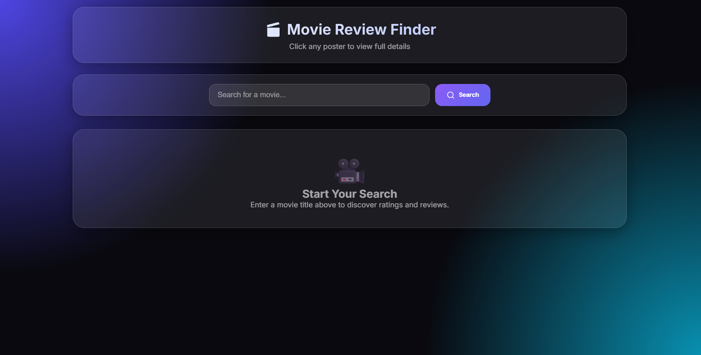
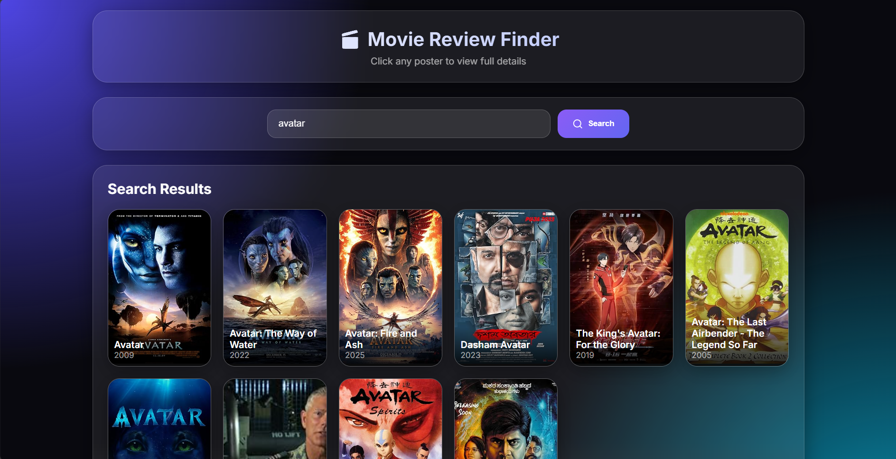
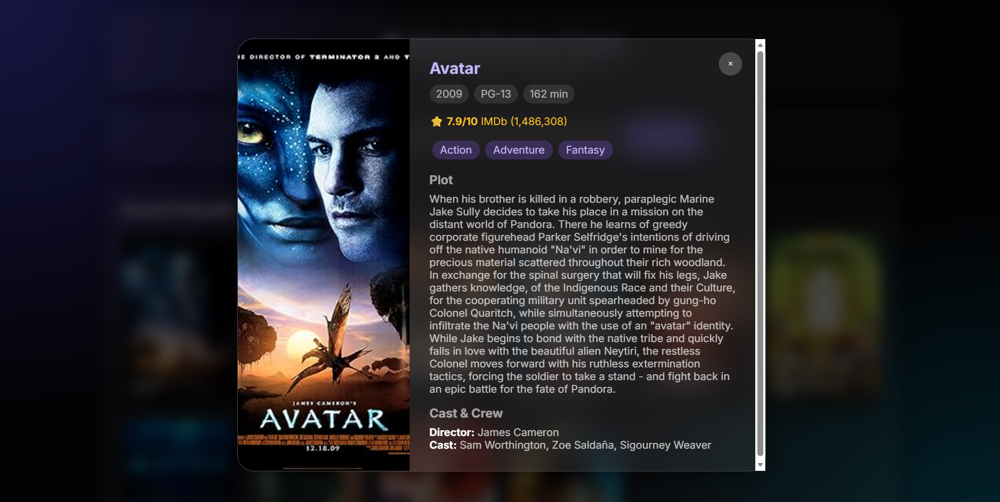

# 🎬 Cinefetch

[](LICENSE)
[](https://github.com/KalaiselvamK23/Cinefetch/stargazers)
[](https://github.com/KalaiselvamK23/Cinefetch/issues)
[](https://github.com/KalaiselvamK23/Cinefetch)

Cinefetch is a modern movie search application that allows users to discover movie information, ratings, plots, cast details, and reviews using the OMDb API.

The project features a frosted glassmorphism user interface with responsive design, smooth animations, and an interactive movie details modal.

---

## 🚀 Live Demo

Add your deployed project link here:

```
https://cinefetch.netlify.app/
```

---

## 📸 Screenshots

### 🏠 Home Page



### 🔍 Search Results



### 🎬 Movie Details



---

# ✨ Features

## 🔎 Movie Search

- Search movies by title
- Fetch real-time data from OMDb API
- Display movie posters and release years

## 🎬 Movie Details

- IMDb rating
- Plot summary
- Genre information
- Director details
- Cast information
- Runtime and movie classification

## 🎨 User Interface

- Frosted glassmorphism design
- Responsive movie grid
- Smooth animations
- Modern dark theme
- Interactive movie cards
- Modal-based movie details view

## ⚡ Performance

- Lazy-loaded movie posters
- Optimized API requests
- Modular JavaScript structure
- Error handling for failed requests

## ♿ Accessibility

- Keyboard navigation support
- ARIA labels
- Screen-reader friendly messages
- Accessible buttons and interactive elements

---

# 🛠️ Technologies Used

## Frontend

- HTML5
- CSS3
- JavaScript (ES6+)

## API

- OMDb API

## Development Tools

- VS Code
- Prettier

---

## 🛠️ Technologies Used

- HTML5
- CSS3
- JavaScript (ES6+)
- OMDb API

---

# 📂 Project Structure

```
Cinefetch/

├── index.html
│
├── css/
│   └── style.css
│
├── js/
│   ├── script.js
│   ├── config.example.js
│   │
│   ├── api/
│   │   └── movieApi.js
│   │
│   └── components/
│       ├── movieCard.js
│       └── modal.js
│
├── assets/
│   ├── images/
│   │   ├── favicon.png
│   │   └── no-poster.png
│   │
│   └── screenshots/
│       ├── home.png
│       ├── results.png
│       └── modal.png
│
├── .gitignore
├── .prettierrc
├── LICENSE
└── README.md
```

---

# ⚙️ Installation and Setup

## 1. Clone the repository

```bash
git clone https://github.com/your-username/Cinefetch.git
```

## 2. Navigate into the project folder

```bash
cd Cinefetch
```

## 3. Get an OMDb API Key

Create your free API key from:

https://www.omdbapi.com/apikey.aspx

## 4. Configure the API Key

Inside the `js` folder:

Create a copy of:

```
config.example.js
```

Rename it to:

```
config.js
```

Open `config.js`:

```javascript
const CONFIG = {
    OMDB_API_KEY: "YOUR_API_KEY_HERE"
};
```

Replace:

```
YOUR_API_KEY_HERE
```

with your OMDb API key.

---

### 5. Run the project

Open:

```
index.html
```

in your browser.

For better development experience, use VS Code Live Server.

---

# 🔐 API Security

The API key is intentionally separated from the main JavaScript files.

The following file is ignored by Git:

```
js/config.js
```

Only this example file is uploaded:

```
js/config.example.js
```

This prevents accidentally exposing API credentials on GitHub.

---

# 🏗️ JavaScript Architecture

The project follows a modular structure:

```
script.js
    |
    ├── Controls application flow
    |
    ├── Handles user interaction
    |
    └── Updates the UI


movieApi.js
    |
    └── Handles OMDb API communication


movieCard.js
    |
    └── Creates movie result cards


modal.js
    |
    └── Controls movie details popup
```

---

# 🎨 Design Features

The application includes:

- Glassmorphism cards
- Transparent backgrounds
- Blur effects
- Gradient highlights
- Smooth hover transitions
- Responsive layouts

---


# 📱 Responsive Design

The application works on:

- Desktop
- Laptop
- Tablet
- Mobile devices

---

# 🧪 Error Handling

The application handles:

- Empty search input
- Invalid movie searches
- Missing API keys
- API connection failures
- Missing movie posters

---

# 🤝 Contributing

Contributions are welcome.

Steps:

1. Fork this repository

2. Create a branch:

```bash
git checkout -b feature-name
```

3. Make your changes

4. Commit:

```bash
git commit -m "Add new feature"
```

5. Push:

```bash
git push origin feature-name
```

6. Create a Pull Request

---


## 🐛 Issues

If you find any bugs or have suggestions, feel free to open an issue.

---

# 📜 License

This project is licensed under the MIT License.

[View MIT License](LICENSE)

---

# 👨‍💻 Author

Kalaiselvam K

GitHub:

https://github.com/KalaiselvamK23

---

# ⭐ Acknowledgements

- OMDb API for movie information
- IMDb for movie ratings data
- Open-source community for development resources
